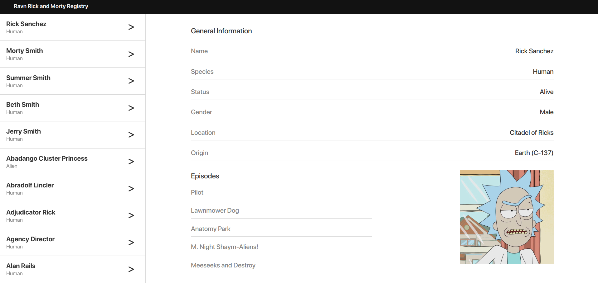

# 🧪 Ravn Rick and Morty Registry

A modern, responsive Rick and Morty character registry built with React. Features include a theme toggle (light/dark mode), global state management using Zustand, custom fonts, and a clean UI.

## 🚀 Features

- 🎨 Light/Dark theme toggle (persistent via localStorage)
- ⚛️ Global state management with Zustand
- 🖋️ Custom fonts with `SF Pro Display`
- 📄 Semantic, accessible, and responsive layout
- ⚡ Fast and smooth UX with modern CSS resets

## 🛠️ Tech Stack

- **React**
- **TypeScript**
- **Zustand** – for global state management
- **CSS Modules** – for scoped styling
- **SF Pro Display** – custom font
- **Vite**
- **PNPM**

## 📸 Preview



## 🌗 Theme Toggle

User preference is stored in `localStorage`, managed via Zustand:

```ts
type Theme = "light" | "dark"

type ThemeState = {
  theme: Theme
  toggleTheme: () => void
}
```
